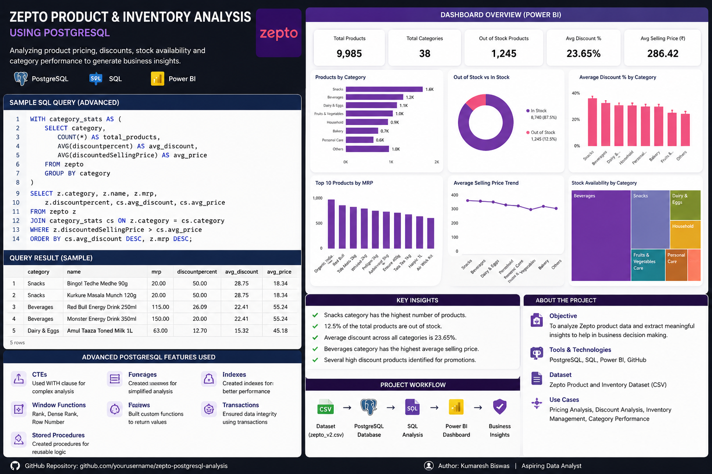

# Zepto Product & Inventory Analysis using PostgreSQL

<p align="center">
  
</p>

<p align="center">
  
</p>

---

## Project Overview

This project analyzes Zepto product and inventory data using PostgreSQL to generate meaningful business insights related to:

- Product pricing
- Discounts
- Inventory availability
- Category performance
- Stock management

The project demonstrates real-world SQL analysis techniques and advanced PostgreSQL concepts commonly used in data analytics and business intelligence.

---

## Objectives

- Analyze product pricing trends
- Identify highly discounted products
- Detect out-of-stock items
- Perform category-wise analysis
- Practice advanced PostgreSQL concepts
- Generate business insights using SQL queries

---

## Tools & Technologies Used

| Tool | Purpose |
|------|----------|
| PostgreSQL | Database Management |
| SQL | Data Analysis |
| Power BI | Dashboard Visualization |
| GitHub | Project Hosting |

---

## Dataset Information

The dataset contains Zepto product and inventory details including:

- Product Name
- Category
- MRP
- Discount Percentage
- Selling Price
- Stock Availability
- Product Weight
- Quantity

Dataset File:

```text
zepto_v2.csv
```

---

## SQL Concepts Used

### Basic SQL
- SELECT
- WHERE
- ORDER BY
- LIMIT
- COUNT

### Moderate SQL
- GROUP BY
- HAVING
- Aggregate Functions
- CASE Statements

### Advanced PostgreSQL
- Joins
- CTEs
- Window Functions
- Views
- Materialized Views
- Stored Procedures
- Functions
- Triggers
- Indexes
- Transactions

---

## Key Business Insights

- Identified categories with the highest discounts
- Found products with low inventory availability
- Analyzed category-wise pricing patterns
- Ranked expensive products using window functions
- Detected out-of-stock products
- Compared average selling prices across categories

---

## Project Structure

```text
zepto-postgresql-analysis/
│
├── dataset/
│   └── zepto_v2.csv
│
├── sql_queries/
│   ├── basic_queries.sql
│   ├── moderate_queries.sql
│   ├── advanced_queries.sql
│
├── screenshots/
│   ├── intro_zepto.png
│   ├── Screenshot 2026-05-26 171625.png
│   ├── Screenshot 2026-05-26 171716.png
│   ├── Screenshot 2026-05-26 171839.png
│
├── powerbi_dashboard/
│   └── zepto_dashboard.pbix
│
└── README.md
```

---

## Sample Advanced SQL Query

```sql
WITH category_stats AS (

    SELECT category,
           COUNT(*) AS total_products,
           AVG(discountPercent) AS avg_discount,
           AVG(discountedSellingPrice) AS avg_price
    FROM zepto
    GROUP BY category

)

SELECT z.category,
       z.name,
       z.mrp,
       z.discountPercent,
       cs.avg_discount
FROM zepto z
JOIN category_stats cs
ON z.category = cs.category
WHERE z.discountedSellingPrice > cs.avg_price;
```

---

## Power BI Dashboard Features

- KPI Cards
- Category Analysis
- Discount Analysis
- Inventory Monitoring
- Price Trend Visualization
- Stock Availability Analysis

---

## Future Improvements

- Add Python data cleaning
- Automate ETL pipeline
- Deploy dashboard online
- Add machine learning predictions
- Integrate real-time analytics

---

## Screenshots

### Dashboard Preview

<p align="center">
  
</p>

---

### SQL Query Output

<p align="center">
  
</p>

---

## Author

# Kumaresh Biswas

Aspiring Data Analyst passionate about:
- PostgreSQL
- SQL
- Power BI
- Python
- Data Visualization

---

## Connect With Me

- LinkedIn: https://www.linkedin.com/
- GitHub: https://github.com/
- Portfolio: https://kumaresh-portfolio-wmdj.vercel.app/

---

## ⭐ If you like this project, give it a star on GitHub!
